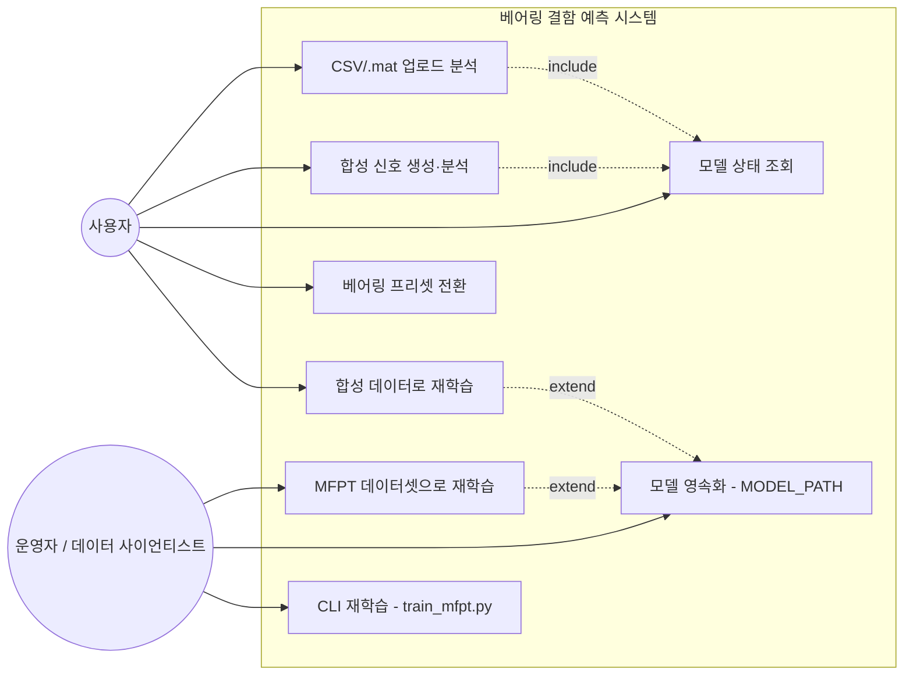
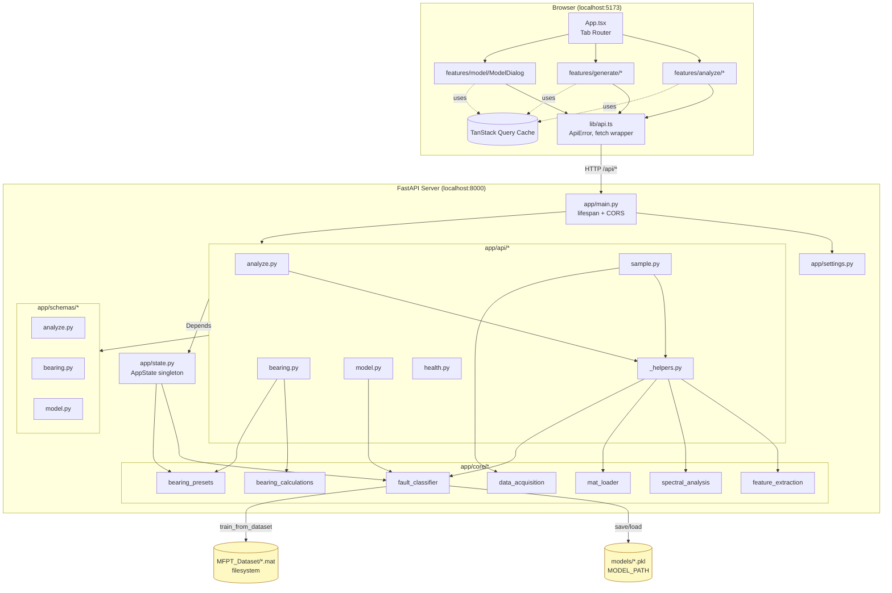
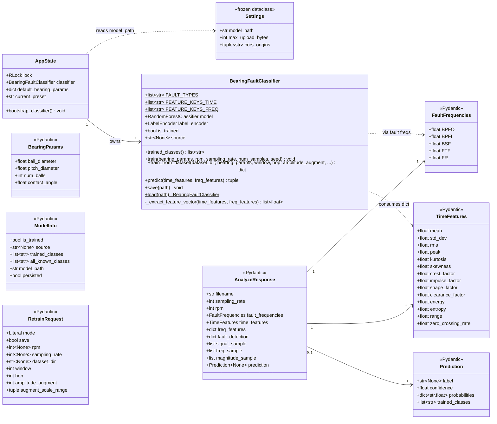
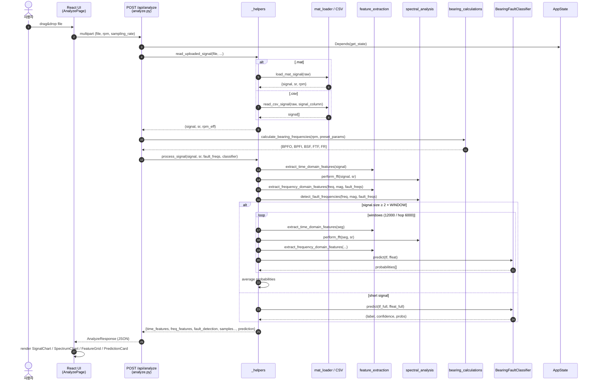
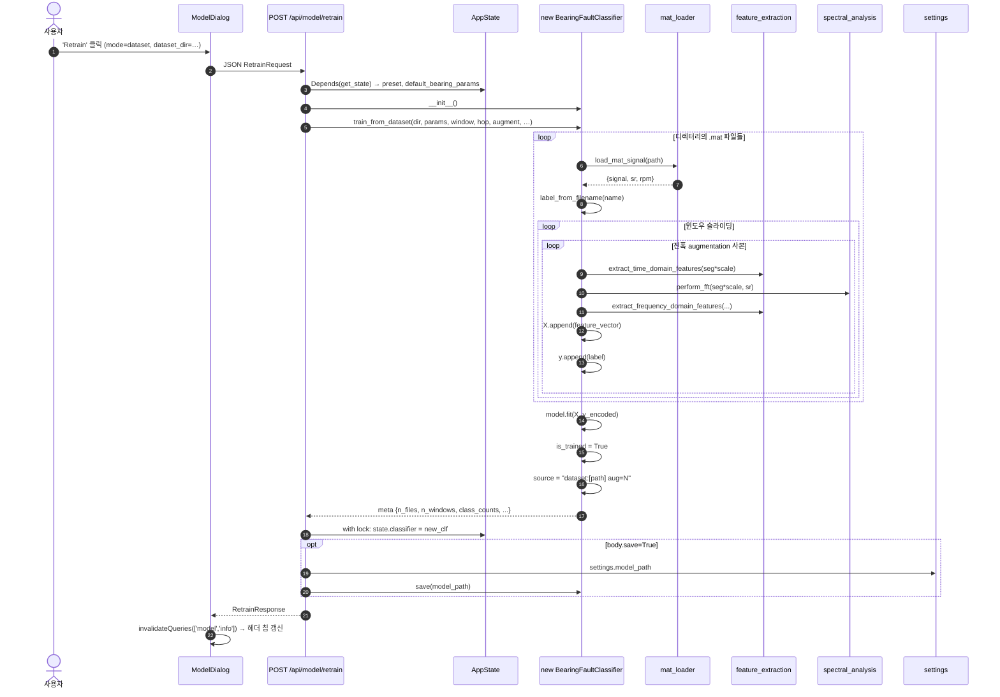
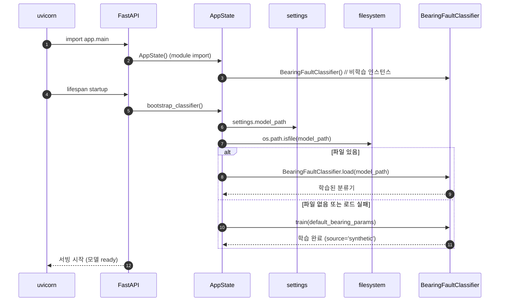
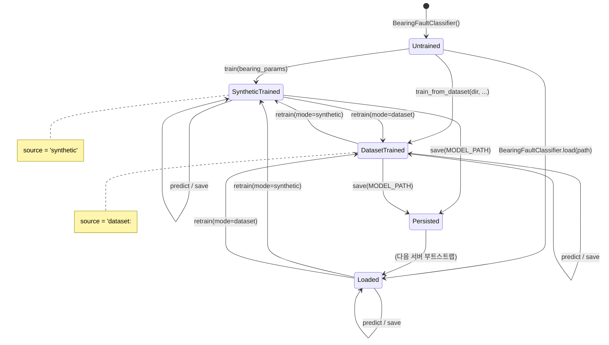
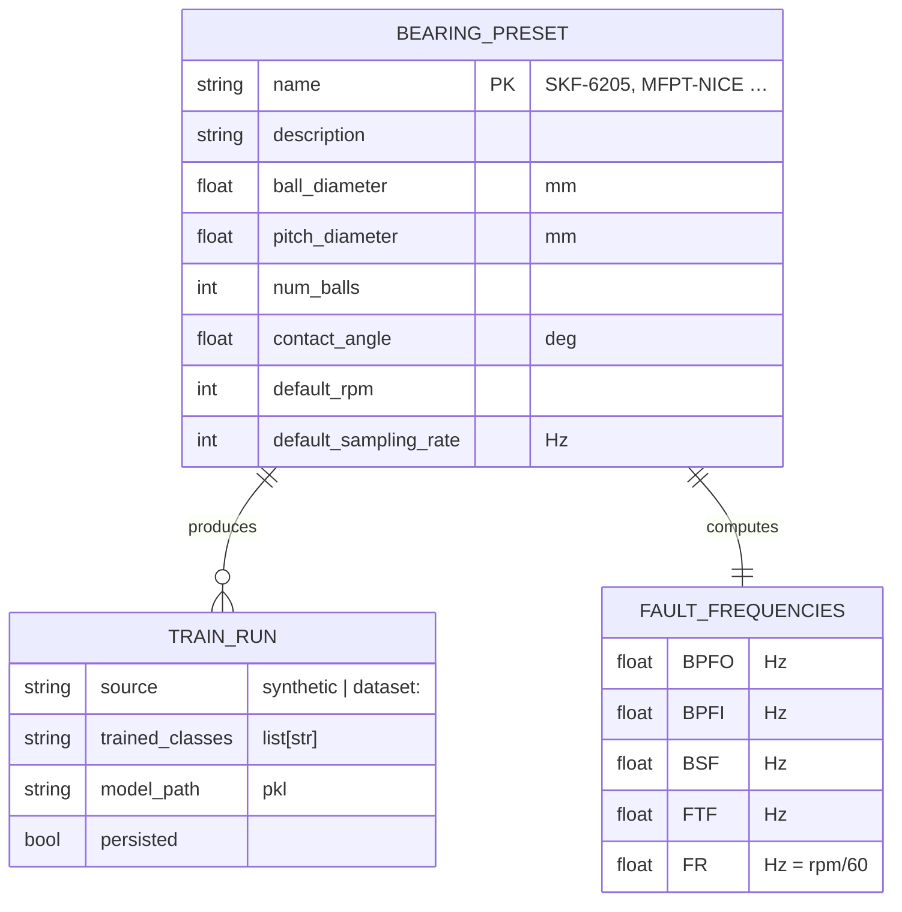

# UML 다이어그램

베어링 결함 예측 시스템의 주요 UML 다이어그램을 Mermaid 표기로 정리합니다. GitHub/GitLab/VS Code Mermaid Preview에서 그대로 렌더링됩니다.

---

## 1. Use Case Diagram (유스케이스)

---

## 2. Component Diagram (컴포넌트)

---

## 3. Class Diagram (백엔드 핵심 클래스)

---

## 4. Sequence Diagram — 파일 업로드 분석

---

## 5. Sequence Diagram — 모델 재학습 (Dataset 모드)

---

## 6. Sequence Diagram — 서버 부트스트랩

---

## 7. State Diagram — 분류기 라이프사이클

---

## 8. ER-Style — 베어링 프리셋 데이터 모델

---

## 9. API 엔드포인트 요약 표

| 메서드 / 경로 | 요청 스키마 | 응답 스키마 | 비고 |
|---|---|---|---|
| `GET  /api/health` | — | `{status: "ok"}` | 헬스체크 |
| `POST /api/analyze` | multipart (`file`, `rpm`, `sampling_rate`, `signal_column?`) | `AnalyzeResponse` | `.mat` 메타데이터가 form 값보다 우선 |
| `GET  /api/sample-data` | query `rpm` | `SampleDataResponse` | 모든 결함 유형 합성 |
| `POST /api/generate-sample` | `GenerateSampleRequest` | `SampleDataResponse` | 단일 결함 유형 |
| `GET  /api/bearing-presets` | — | `BearingPresetsResponse` | 사용 가능한 프리셋 + 현재값 |
| `POST /api/bearing-presets/{name}` | path `name` | `BearingPresetApplyResponse` | 프리셋 전환 |
| `POST /api/bearing-params` | `BearingParamsUpdate` | `BearingParamsResponse` | 베어링 사양 수동 변경 |
| `GET  /api/model/info` | — | `ModelInfo` | 현재 분류기 상태 |
| `POST /api/model/retrain` | `RetrainRequest` | `RetrainResponse` | mode = `synthetic` / `dataset` |
| `POST /api/predict` | `PredictRequest` | `PredictResponse` | 사전 추출된 피처 dict 직접 예측 |
