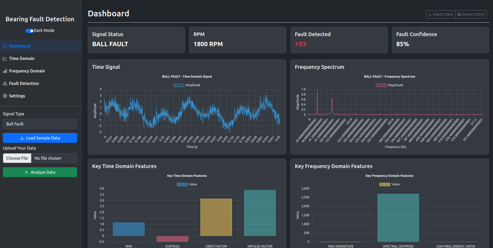

# 베어링 고장 감지 시스템
### Flask와 특징 추출 기능을 테스트하기 위해 구현하였습니다.

이 테스트 프로젝트는 진동 신호를 분석하여 베어링 고장을 감지하는 웹 기반 시스템입니다. 
시간 도메인과 주파수 도메인 특징을 모두 활용하여 다양한 베어링 고장 유형(외륜 결함, 내륜 결함, 볼 결함, 케이지 결함)을 분석합니다.



## 기능

- **시간 및 주파수 도메인 분석**: 진동 신호에서 다양한 특징 추출
- **베어링 결함 주파수 계산**: 베어링 파라미터를 기반으로 이론적 결함 주파수 계산
- **결함 감지 및 시각화**: 검출된 결함 주파수 및 특징 시각화
- **사용자 정의 샘플 생성**: 다양한 결함 유형 및 조건에 대한 샘플 데이터 생성
- **파일 업로드 및 분석**: 사용자 소유 데이터 분석 기능
- **반응형 웹 인터페이스**: 다크 테마 지원 반응형 UI

## 프로젝트 구조

```
bearing-fault-detection/
│
├── app.py                    # Flask 백엔드 애플리케이션
│
├── data_acquisition.py       # 데이터 획득 모듈
├── bearing_calculations.py   # 베어링 계산 모듈
├── spectral_analysis.py      # 스펙트럼 분석 모듈
├── feature_extraction.py     # 특징 추출 모듈
│
├── templates/                # Flask 템플릿 디렉토리
│   └── index.html            # 메인 HTML 페이지
│
├── static/                   # 정적 파일 디렉토리
│   ├── css/                  # CSS 파일
│   │   └── style.css         # 스타일시트
│   └── js/                   # JavaScript 파일
│       └── app.js            # 클라이언트 JavaScript
│
├── uploads/                  # 업로드된 파일을 저장할 디렉토리
│
└── requirements.txt          # 필요한 패키지 목록
```

## 설치 및 실행

### 필수 요구사항

- Python 3.8 이상
- Flask 및 관련 패키지

### 설치 방법

1. 저장소 복제:
   ```bash
   git clone https://github.com/yourusername/bearing-fault-detection.git
   cd bearing-fault-detection
   ```

2. 가상 환경 생성 및 활성화:
   ```bash
   python -m venv venv
   source venv/bin/activate  # Windows: venv\Scripts\activate
   ```

3. 의존성 설치:
   ```bash
   pip install -r requirements.txt
   ```

### 실행 방법

1. Flask 애플리케이션 실행:
   ```bash
   python app.py
   ```

2. 웹 브라우저에서 다음 주소로 접속:
   ```
   http://localhost:5000
   ```

## 사용 방법

### 데이터 로드

- **샘플 데이터 로드**: "Load Sample Data" 버튼 클릭
- **사용자 정의 샘플 생성**: "Generate Custom Sample" 버튼 클릭 후 파라미터 설정
- **사용자 데이터 분석**: "Upload Your Data" 섹션에서 파일 선택 후 "Analyze Data" 버튼 클릭

### 베어링 파라미터 설정

- Settings 탭에서 베어링 파라미터(볼 직경, 피치 직경, 볼 개수, 접촉각) 조정

### 결과 분석

- **Dashboard**: 주요 시간 및 주파수 도메인 특징 요약
- **Time Domain**: 상세한 시간 도메인 특징 및 시각화
- **Frequency Domain**: 주파수 스펙트럼 및 주파수 도메인 특징
- **Fault Detection**: 이론적 및 검출된 결함 주파수, 결함 심각도 표시

## 주요 모듈 설명

- **data_acquisition.py**: 데이터 수집 및 샘플 데이터 생성 기능
- **bearing_calculations.py**: 베어링 결함 주파수 계산 
- **spectral_analysis.py**: FFT 및 주파수 분석 기능
- **feature_extraction.py**: 시간 도메인과 주파수 도메인 특징 추출
- **app.py**: Flask 웹 애플리케이션, API 엔드포인트 정의

## 지원하는 베어링 결함 유형

1. **외륜 결함 (BPFO)**: 외륜 궤도 표면의 결함
2. **내륜 결함 (BPFI)**: 내륜 궤도 표면의 결함 
3. **볼 결함 (BSF)**: 구름 요소(볼)의 결함
4. **케이지 결함 (FTF)**: 볼을 고정하는 케이지의 결함